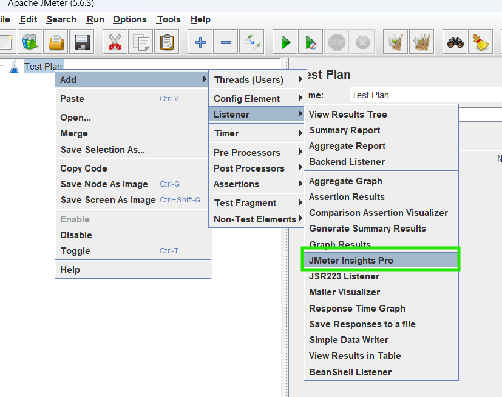
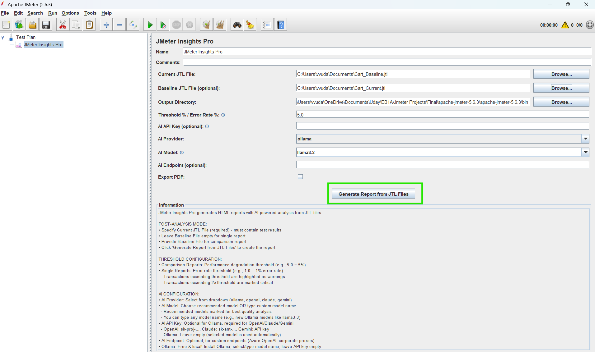

# JMeter Insights Pro

[](https://github.com/vasukiudaykiranvudathala/jmeter-insights-pro)
[](LICENSE)
[](https://jmeter.apache.org/)

A comprehensive JMeter plugin that generates interactive HTML performance reports with AI-powered analysis, comparison capabilities, and PDF export functionality.

## 🚀 Features

✅ **AI Powered Summary** - Intelligent performance analysis with executive summaries, critical findings, and actionable recommendations  
✅ **Compare Two JTL Files** - Baseline vs current performance with threshold-based regression detection  
✅ **Single JTL Report** - Detailed HTML report with AI summary for single test runs  
✅ **Interactive HTML Reports** - Modern, responsive UI with interactive charts and tabs  
✅ **Multi-AI Provider Support** - OpenAI, Claude, Gemini, or Ollama (free & local!)  
✅ **Advanced Metrics** - P90, P95, P99 percentiles, throughput, error rates  
✅ **Charts & Visualizations** - Response time, throughput, error rate charts using Chart.js  
✅ **PDF Export** - Export reports to PDF format  
✅ **JMeter Native Integration** - Works as a native JMeter listener in the GUI  
✅ **CLI Support** - Run from command line for CI/CD integration  
✅ **Cross-Platform** - Works on Windows, macOS, and Linux

## 📦 Installation

### Method 1: JMeter Plugins Manager (Recommended)

1. Install [JMeter Plugins Manager](https://jmeter-plugins.org/install/Install/)
2. Open JMeter → Options → Plugins Manager
3. Search for "JMeter Insights Pro"
4. Click Install and restart JMeter

### Method 2: Manual Installation

1. Download the latest `jmeter-insights-pro-1.0.0.jar` from [Releases](https://github.com/vasukiudaykiranvudathala/jmeter-insights-pro/releases)

2. Copy the JAR file to JMeter's `lib/ext` directory:
   ```bash
   # Linux/Mac
   cp jmeter-insights-pro-1.0.0.jar $JMETER_HOME/lib/ext/
   
   # Windows
   copy jmeter-insights-pro-1.0.0.jar %JMETER_HOME%\lib\ext\
   ```

3. Restart JMeter

4. Add the listener to your test plan:
   - Right-click on Thread Group → Add → Listener → **JMeter Insights Pro**

### Method 3: Build from Source

```bash
git clone https://github.com/vasukiudaykiranvudathala/jmeter-insights-pro.git
cd jmeter-insights-pro
mvn clean package
cp target/jmeter-insights-pro-1.0.0.jar $JMETER_HOME/lib/ext/
```

## Usage

### As JMeter Listener

1. **Add the Listener** to your test plan

2. **Configure Settings**:
   - **Current JTL File**: Path to current test results (required)
   - **Baseline JTL File** (optional): Path to baseline results for comparison
   - **Output Directory**: Where to save reports (default: current directory)
   - **Threshold (%)**: Performance degradation threshold (default: 5.0%)
   - **AI Provider**: Select from dropdown (ollama, openai, claude, gemini)
   - **AI Model**: Choose recommended model or enter custom model name
   - **AI API Key** (optional): Required for OpenAI/Claude/Gemini, leave empty for Ollama
   - **AI Endpoint** (optional): Custom API endpoint if needed
   - **Export to PDF**: Check to export PDF version
   

3. **Click Generate Report** - Report is automatically displayed when generates completes

    [JMeter Insight Pro Comparision Report_UI.mp4](docs/screenshots/JMeter%20Insight%20Pro%20Comparision%20Report_UI.mp4)

### AI Provider Configuration

#### Ollama (Free & Local - Recommended for Getting Started)
- **Provider**: ollama
- **Model**: llama3.2 (Recommended), llama3.1, mistral, codellama, etc.
- **API Key**: Leave empty
- **Setup**: Install [Ollama](https://ollama.ai) and run `ollama serve`

#### OpenAI
- **Provider**: openai
- **Model**: gpt-4 (Recommended), gpt-4-turbo, gpt-3.5-turbo, gpt-4o
- **API Key**: Your OpenAI API key (sk-proj-...)
- **Setup**: Get API key from [OpenAI Platform](https://platform.openai.com/)

#### Claude (Anthropic)
- **Provider**: claude
- **Model**: claude-3-5-sonnet-20241022 (Recommended), claude-3-opus, claude-3-haiku
- **API Key**: Your Anthropic API key (sk-ant-...)
- **Setup**: Get API key from [Anthropic Console](https://console.anthropic.com/)

#### Gemini (Google)
- **Provider**: gemini
- **Model**: gemini-1.5-pro (Recommended), gemini-1.5-flash
- **API Key**: Your Google AI API key
- **Setup**: Get API key from [Google AI Studio](https://makersuite.google.com/)

### Command Line Interface

```bash
# Single with Ollama (no PDF at runtime, but user can still export it directly from Browser):
java -jar jmeter-insights-pro-1.0.0.jar results.jtl ./reports 10.0 llama3.2 false ollama

#Single with OpenAI (with PDF):
java -jar jmeter-insights-pro-1.0.0.jar results.jtl ./reports 10.0 sk-proj-xxx true openai

# Comparison with Ollama (no PDF):
java -jar jmeter-insights-pro-1.0.0.jar current.jtl baseline.jtl ./reports 5.0 llama3.2 false ollama

#Comparison with Claude (with PDF):
java -jar jmeter-insights-pro-1.0.0.jar current.jtl baseline.jtl ./reports 5.0 sk-ant-xxx true claude

# Generate single report without AI
java -jar jmeter-performance-reporter-1.0.0.jar results.jtl

# Generate comparison report without AI
java -jar jmeter-performance-reporter-1.0.0.jar current.jtl baseline.jtl ./reports 5.0
```


#### CLI Arguments

| Argument | Description | Required | Default |
|----------|-------------|----------|---------|
| current-jtl | Path to current JTL results file | Yes | - |
| baseline-jtl | Path to baseline JTL file for comparison | No | - |
| output-dir | Output directory for reports | No | Current directory |
| threshold | Performance degradation threshold (%) | No | 5.0 |
| api-key | OpenAI API key for AI summaries | No | OPENAI_API_KEY env var |
| export-pdf | Export to PDF (true/false) | No | false |

## Report Features

### Comparison Report (Two JTL Files)

- **Executive Summary**: AI-generated analysis of performance changes
- **Statistics Dashboard**: 
  - Total transactions tested
  - Number of degraded transactions
  - Test execution timestamps
- **Detailed Comparison Table**:
  - Baseline vs Current average response times
  - Percentage change with visual indicators
  - Status badges (Critical/Warning/Improved)
- **Interactive Charts**:
  - Response time comparison bar chart
  - Performance change distribution
- **PDF Export**: Print-friendly version

### Single Report (One JTL File)

- **Executive Summary**: AI-generated performance assessment
- **Statistics Dashboard**:
  - Total transactions
  - Total requests and errors
  - Test execution timestamps
- **Detailed Metrics Table**:
  - Average, P90, P95, P99 response times
  - Error rate with visual indicators
  - Throughput (requests/second)
  - Success/Total request counts
- **Interactive Charts**:
  - Response time distribution (Avg vs P95)
  - Error rate by transaction
- **PDF Export**: Print-friendly version

## Configuration

### AI Integration

The plugin supports AI-generated summaries using OpenAI's API:

1. **Set API Key**:
   - In JMeter GUI: Enter in "AI API Key" field
   - CLI: Pass as argument or set `OPENAI_API_KEY` environment variable
   - If not provided, fallback summaries are generated

2. **Custom AI Endpoint**:
   - Default: `https://api.openai.com/v1/chat/completions`
   - Can be changed to use Azure OpenAI or other compatible endpoints

### Threshold Configuration

The threshold determines when a transaction is marked as "degraded":
- Default: 5.0% (transaction is degraded if response time increases by >5%)
- Configurable per test run
- Used for both visual indicators and failure detection

## JTL File Requirements

The plugin expects CSV-format JTL files with at least these columns:
- `timeStamp` - Request timestamp (epoch milliseconds)
- `elapsed` - Response time in milliseconds
- `label` - Transaction/sampler name
- `success` - Boolean success indicator

### JMeter Configuration

Ensure your JMeter test plan saves results in CSV format with required fields:

```xml
<ResultCollector>
    <value class="SampleSaveConfiguration">
        <time>true</time>
        <latency>true</latency>
        <timestamp>true</timestamp>
        <success>true</success>
        <label>true</label>
        <code>true</code>
        <message>true</message>
        <threadName>true</threadName>
        <dataType>true</dataType>
        <encoding>false</encoding>
        <assertions>true</assertions>
        <subresults>true</subresults>
        <responseData>false</responseData>
        <samplerData>false</samplerData>
        <xml>false</xml>
        <fieldNames>true</fieldNames>
        <responseHeaders>false</responseHeaders>
        <requestHeaders>false</requestHeaders>
        <responseDataOnError>false</responseDataOnError>
        <saveAssertionResultsFailureMessage>true</saveAssertionResultsFailureMessage>
        <assertionsResultsToSave>0</assertionsResultsToSave>
        <bytes>true</bytes>
        <sentBytes>true</sentBytes>
        <url>true</url>
        <threadCounts>true</threadCounts>
        <idleTime>true</idleTime>
        <connectTime>true</connectTime>
    </value>
</ResultCollector>
```

## CI/CD Integration

### Jenkins Pipeline Example

```groovy
pipeline {
    agent any
    stages {
        stage('Performance Test') {
            steps {
                sh 'jmeter -n -t test.jmx -l results.jtl'
            }
        }
        stage('Generate Report') {
            steps {
                sh '''
                    java -jar jmeter-performance-reporter-1.0.0.jar \
                        results.jtl \
                        baseline.jtl \
                        ./reports \
                        5.0 \
                        ${OPENAI_API_KEY} \
                        true
                '''
            }
        }
        stage('Publish Report') {
            steps {
                publishHTML([
                    reportDir: 'reports',
                    reportFiles: 'performance_report.html',
                    reportName: 'Performance Report'
                ])
            }
        }
    }
}
```

### GitHub Actions Example

```yaml
name: Performance Testing
on: [push]
jobs:
  test:
    runs-on: ubuntu-latest
    steps:
      - uses: actions/checkout@v2
      
      - name: Run JMeter Test
        run: |
          jmeter -n -t test.jmx -l results.jtl
      
      - name: Generate Performance Report
        run: |
          java -jar jmeter-performance-reporter-1.0.0.jar \
            results.jtl \
            baseline.jtl \
            ./reports \
            5.0 \
            ${{ secrets.OPENAI_API_KEY }} \
            true
      
      - name: Upload Report
        uses: actions/upload-artifact@v2
        with:
          name: performance-report
          path: reports/
```

## Building from Source

### Prerequisites

- Java 11 or higher
- Maven 3.6 or higher
- JMeter 5.4+ (tested with 5.6.3)

### Build Steps

```bash
# Clone the repository
git clone https://github.com/vasukiudaykiranvudathala/jmeter-insights-pro.git
cd jmeter-performance-reporter

# Build the project
mvn clean package

# Run tests
mvn test

# The JAR file will be in target/jmeter-performance-reporter-1.0.0.jar
```
## Troubleshooting

### Plugin Not Appearing in JMeter

- Ensure JAR is in `$JMETER_HOME/lib/ext/`
- Check JMeter logs for errors
- Verify Java version compatibility (11+)

### AI Summaries Not Generated

- Verify API key is correct
- Check network connectivity to OpenAI
- Review logs for API errors
- Fallback summaries will be used if AI fails

### PDF Export Fails

- Ensure sufficient disk space
- Check write permissions on output directory
- Verify HTML report was generated successfully

### Charts Not Displaying

- Ensure internet connectivity (Chart.js CDN)
- Check browser console for JavaScript errors
- Try opening report in different browser

## License

This project is licensed under the Apache License 2.0.

## Contributing

Contributions are welcome! Please submit pull requests or open issues for bugs and feature requests.

## Support

For issues, questions, or feature requests, please open an issue on the project repository.

## Changelog

### Version 1.0.0
- Initial release
- Comparison and single report generation
- AI-powered summaries
- Interactive HTML reports with charts
- PDF export functionality
- JMeter listener plugin
- CLI support
- Cross-platform compatibility
